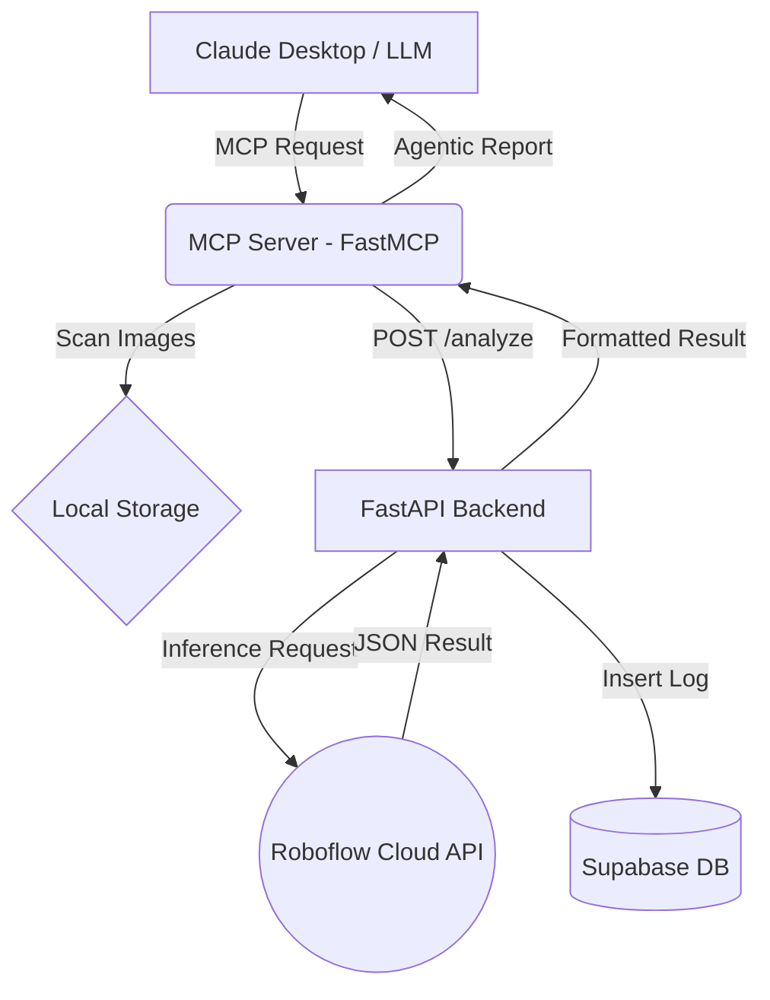

# 👷‍♂️ Agentic Vision: Autonomous ISG Inspection Agent (MCP + YOLOv8 + Supabase)

[](https://www.python.org/)

This project is an autonomous Occupational Health and Safety (ISG) inspection system based on Model Context Protocol (MCP), giving Large Language Models (LLMs) the ability to "see", "interpret", and "take action" in the real world.

Unlike standard object detection projects, it is built on an "Agentic Workflow". Claude 3.5 Sonnet autonomously finds camera recordings in the system, analyzes them, and produces a risk report according to ISG regulations.

## Table of Contents

- [🚀 Features](#-features)
- [🛠️ Architecture](#️-architecture)
- [📦 Installation](#-installation)
- [⚙️ Configuration](#️-configuration)
- [Claude Desktop Integration](#claude-desktop-integration)
- [🎯 Usage](#-usage)
- [🤝 Contributing](#-contributing)

## 🚀 Features

- **Model Context Protocol (MCP)**: Secure access for LLM to local file system and custom APIs.
- **Autonomous Analysis**: Automatic detection and analysis of the latest image dropped in the "images" folder.
- **Smart Reporting**: Converting raw JSON data into a meaningful report according to ISG Law No. 6331.
- **Corporate Memory**: Instant logging of all violations to Supabase (PostgreSQL) database.
- **Modern Architecture**: FastAPI (Asynchronous) + Roboflow (Cloud Inference).

## 🛠️ Architecture



## 📦 Installation

### Prerequisites

- Python 3.10+
- Conda or virtualenv

### Steps

1. Clone the repository:

   ```bash
   git clone https://github.com/fatihberkanteren/agentic-vision-server.git
   cd agentic-vision-server
   ```

2. Create and activate environment:

   ```bash
   conda create -n agentic-vision python=3.10 -y
   conda activate agentic-vision
   pip install -r requirements.txt
   ```

## ⚙️ Configuration

Create a `.env` file and enter your information:

```
ROBOFLOW_API_KEY=your_api_key
SUPABASE_URL=your_project_url
SUPABASE_KEY=your_service_key
```

## Claude Desktop Integration

Add the following to the `mcpServers` section in your Claude Desktop settings (`claude_desktop_config.json`):

```json
{
  "mcpServers": {
    "agentic-vision": {
      "command": "C:/path/to/your/python.exe",
      "args": ["mcp_server.py"]
    }
  }
}
```

## 🎯 Usage

After the system is up, simply give this command to Claude:

"Check the field cameras, report if there is an ISG violation and log to the database."

The agent will find the latest photo in the images/ folder, detect personnel missing helmets/vests, and provide you with a professional inspection report.

## 🤝 Contributing

Contributions are welcome! Please open an issue or submit a pull request.
